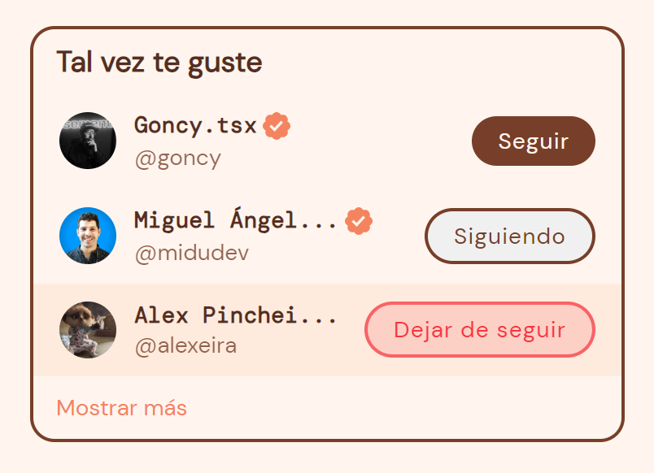

# Twitter Follow Card

Un pequeño proyecto de la sección de **Tal vez te guste** de twitter, para retomar la programación con [`React`](https://es.react.dev/).

Le di un toque personal utilizando mi paleta de colores favoritos y otro tipo de tipografía, sin modificar tanto la base de twitter.

## ¿Qué repase?

- `Componetización`, a través de estas funciones podemos crear elementos reutilizables para nuestra aplicación, en este caso, cada uno de los usuarios es un componente reutilizable, junto con su verificado.
- `Estilos condicionales`, gracias al hook `useState()` podemos dotar de interactividad a nuestros componentes y también a los estilos según el estado del botón **Seguir**.
- `Renderizado de listas`, nos permite generar componentes dinámicos, que representan los datos del componente **TwitterUser**, en este caso su nombre, su usuario y si  esta verificado.

## Ejemplo de uso

En el caso de que quieras ver el componente por tu cuenta, en tu navegador, debes clonar el repositorio en tu equipo local y luego dentro del proyecto, ejecuta los siguientes comandos:

```sh
pnpm install 
pnpm dev
```

¡Listo! ahora podras ver el componente en el puerto [`localhost:5173`](http://localhost:5173/).
