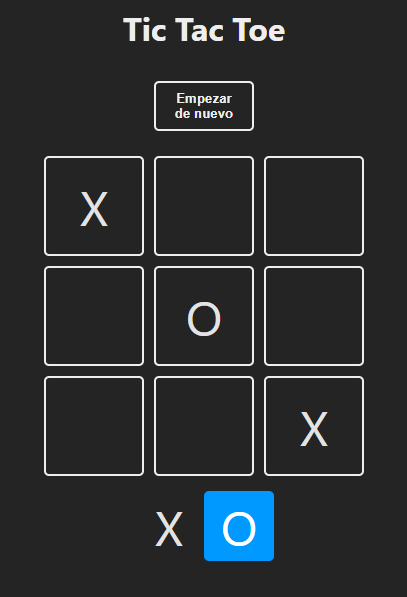

# Tic Tac Toe

Un simple Tic Tac Toe o Tres en raya, para practicar conceptos de [`React`](https://es.react.dev/).

En esta ocación no solo utilice mi paleta de colores y tipografía favorita, sino que también, agregué un contador de victorias y una animación para las lineas ganadoras.

Aqui un foto de como se veia al inicio y cual fue el resultado final.

 ➡️  

Adicionalmente tanto la partida como las victorias guardan su estado gracias al `localStorage`.

## ¿Qué repase?

- `Componetización` la componetización es una de las bases principales de `React`, gracias a ella podemos reutilizar tanto la UI como la lógica de nuestra aplicación.
- `Retraso de la Renderización` en esta aplicación utilice el método global `setTimeout()` en un componente para aplicar un renderizado en otros componentes, de esta forma también puedo reutilizarlo en otros proyectos.
- `useEffect` gracias a este **hook** podemos realizar tareas secundarias, mientras mantenemos la lógica de estos efectos separada de la lógica principal.

## Como probarlo

Puedes ver el resultado en este [link]().

Pero en el caso de que quieras ver el componente por tu cuenta, en tu navegador, debes clonar el repositorio en tu equipo local y luego dentro del proyecto, ejecuta los siguientes comandos:

```sh
pnpm install 
pnpm dev
```

¡Listo! ahora podras ver el componente en el puerto [`localhost:5173`](http://localhost:5173/).
